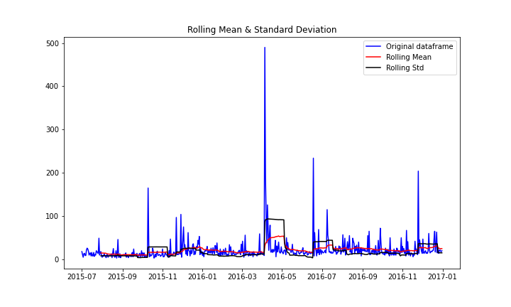
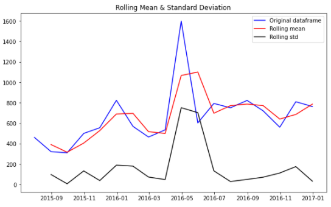

# Intro

This repository includes building timeseries analysis (tsa) models for [kaggle web traffic competition](https://www.kaggle.com/c/web-traffic-time-series-forecasting).
The dataset contains 145063 URLs. Each requires a different tsa. As the methodology is the same, I take the first URL in dataset, "2NE1_zh.wikipedia.org_all-access_spider" and apply all different methods to it.

### Notebook explanation
+ timeseries_notebook1: Getting to know and cleaning data, transposig, building index and saving into a dataset for furhter analysis.
+ ARIMA: Buidling an AR (Auto Regressive), MA (Moving Average) and ARIMA (AR Integrated MA) model and using the ARIMA one for making predictions.

Here we apply Augment Dickey Fuller Test to check if the timeseries is stationary by calculating the p-value. I have generated some charts and interpreted the result like below which is for daily result with window size 30:

Or this chart which is aggregated on monthly data.

+ LSTM_For_TSA: Data is prepared for feeding an LSTM model. The model is built by using Keras. Different architectures are checked by using different number of neurons and different number of layers with different dropout rates to see which model results the lowest MSE and therefore is the most accurate one.

To be able to apply LSTM on timeseries data, we need to create the following data structure and feed it to the LSTM network.

| Feature 1 | Feature 2 | Feature 3 | Target Value|
| :- | :- | :- | :- |
| ts(t-3) | ts(t-2) | ts(t-1) | ts(t) |
| ts(t-2) | ts(t-1) | ts(t)   | ts(t+1)
| ts(t-1) |  ts(t)  | ts(t+1) | ts(t+2)
| ts(t) | ts(t+1) | ts(t+2)    |      ts(t+3)

In this notebook different LSTM networks are created and trained with above data structure. Different architectures of LSTM is checked (Different number of layers with different number of neurons at each level with or without dropout, with different activation functions). At the end the best architecture is introduced.

+ 4-multivariate_tsa notebook: This is quite a big notebook. It contains preparing a dataframe from the timeseries to feed an XGBoost, a lightgbm, and a catboost model. In fact we have changed the timeseries problem from a univariate to a multivariate problem and like my other repositories for making ensemble models, I use that dataframe to train a model. 

As by nature our dataset is univariate, I need to first build the following dataset and extract features like mean, std, difference between the current value with 1, 2 and 3 previous days.

| Feature 1 | Feature 2 | Feature 3 | Feature 4 | Feature 5 | Feature 6 | Feature 7 | Feature 8 | target |
| :- | :- | :- | :- | :- | :- | :- | :- | :- |              
| var(t=-3) |  var(t=-2) |   var(t=-1) |  mean |  std |   var(t)-var(t=-3)  |  var(t)-var(t=-2) |   var(t)-var(t=-1) |  

Later an ensemble of models is trained with this data structure. I trained 5 xgboost, 5 lightgbm and 5 catboost models. Lightgbm requires large number of data to be trained well. As we only have 550 records (after creating the dataframe from timeseries), lightgbm performs poorly. 

I used pickle to dump each trained model. I weighted each catboost and xgboost trained model twice as a lightgbm one. Later on I made a hard voter to calculate the mean of the prediction of each model. To calculate the score of the ensemble voter I used MSE.

